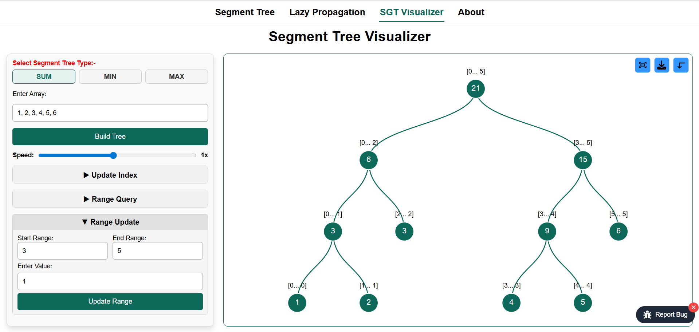

# Segment Tree Visualizer

## Introduction

An interactive Segment Tree Visualizer built with Next.js that helps learners and competitive programmers understand how segment trees work internally — including building, queries, point updates, and lazy propagation — through step-by-step visual animations. The project also includes C++ implementations of segment tree algorithms for reference.

🔗 **Live Demo:**
👉 [https://segment-tree-visualization.vercel.app/](https://segment-tree-visualization.vercel.app/)



## Features

### Web Visualizer

- **Multiple Segment Tree Types:**
  - Find Minimum (Range Min Query)
  - Find Maximum (Range Max Query)
  - Find Sum (Range Sum Query)
  - Lazy Propagation for Range Updates

- **Interactive Operations:**
  - Update a specific index value
  - Perform range queries (sum, min, max)
  - Apply range updates with lazy propagation
  - Visualize tree construction and updates

- **Visualization Controls:**
  - Adjustable animation speed
  - Custom input arrays or default values
  - Real-time tree display with node ranges and values
  - Color-coded animations for updates and traversals
  - Download visualization as image
  - Zoom controls for better viewing

- **Educational Pages:**
  - Basic Segment Tree explanation
  - Lazy Propagation concepts and implementation

### C++ Implementations

- Standard Segment Tree (`SGT.cpp`)
- Segment Tree with Lazy Propagation (`SGT_Lazy_Propagation.cpp`)

## 🛠️ Tech Stack

### Frontend

- **Next.js (App Router)**
- **React**
- **JavaScript (ES6+)**
- **CSS Modules**

### Visualization & Utilities

- **D3.js** (for tree rendering)
- **SVG Manipulation**
- **Custom animation logic**

## Project Structure

```
segment-tree-visualizer/
├── src/
│   ├── app/
│   │   ├── layout.js
│   │   ├── page.js
│   │   ├── not-found.js
│   │   ├── about/
│   │   ├── segment-tree/
│   │   └── lazy-propagation-in-segment-tree/
│   ├── components/
│   │   ├── Home.js
│   │   ├── InputSideBar.js
│   │   ├── Navbar.js
│   │   ├── TreeVisualizerSideBar.js
│   │   ├── functions/
│   │   │   └── BuildHierarchy.js
│   │   ├── operations/
│   │   │   ├── HandleRangeQuery.js
│   │   │   ├── HandleRangeUpdate.js
│   │   │   └── HandleUpdateIndex.js
│   │   ├── styles/
│   │   └── utils/
│   │       ├── segmentTreeUtils.js
│   │       ├── InputSection.js
│   │       ├── SegmentTreeD3.js
│   │       └── TreeVisualizer.js
├── public/
├── SGT.cpp
├── SGT_Lazy_Propagation.cpp
├── package.json
├── next.config.mjs
├── jsconfig.json
├── eslint.config.mjs
├── .gitignore
└── README.md
```

## Getting Started

### Prerequisites

- Node.js (v18 or higher)
- npm package manager
- C++ compiler (for running C++ examples, optional)

### Installation

1. **Clone the repository:**

   ```bash
   git clone https://github.com/your-username/segment-tree-visualizer.git
   cd segment-tree-visualizer
   ```

2. **Install dependencies:**

   ```bash
   npm install
   ```

3. **Run the development server:**

   ```bash
   npm run dev
   ```

4. **Open your browser:**
   Navigate to [http://localhost:3000](http://localhost:3000)

## Usage

### Web Application

1. **Select Tree Type:** Choose between Sum, Min, or Max operations
2. **Input Data:** Enter your own array values or use the default array
3. **Perform Operations:**
   - Update a specific index
   - Query a range for sum/min/max
   - Apply range updates (with lazy propagation)
4. **Control Visualization:** Adjust speed and explore different views

## 🎓 Who Is This For?

- Students learning **Data Structures**
- Competitive Programmers
- Interview Preparation
- Anyone who wants a **visual intuition** of segment trees

## 📌 Future Improvements

- Step backward / step forward controls
- Step-by-step animation control
- Dark / Light theme toggle
- UI and UX improvements

## 🤝 Contributing

Contributions are welcome!
If you find a bug or have a feature idea, feel free to open an issue or submit a pull request.

## 📬 Feedback & Bug Reports

Use the **Report Bug** button inside the application to share feedback or issues.

## 🧑‍💻 Author

**[Yogesh Saini](https://saini-yogesh.github.io/Portfolio/)**

- Competitive Programmer (Codeforces- **[Specialist](https://codeforces.com/profile/yogesh_1___)**, LeetCode- **[Knight](https://leetcode.com/u/yogesh_1___/)**)
- Full-Stack & Backend-focused Developer
- Interested in scalable systems and AI-powered developer tools
